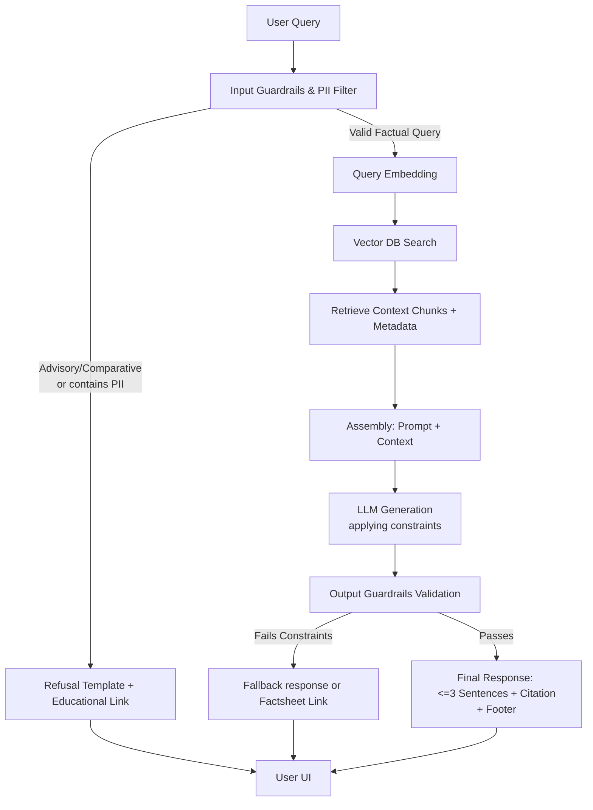

# Mutual Fund FAQ Assistant: RAG Architecture Details

## 1. System Overview
The system is built on a Retrieval-Augmented Generation (RAG) architecture tailored to provide factual, constraint-driven responses about mutual funds using official documentation. It prioritizes strict adherence to authorized knowledge sources (e.g., AMCs, AMFI, SEBI) and completely limits advisory capabilities.

## 2. Architecture Components

### A. Data Ingestion Pipeline (Offline/Batch)
**Goal:** Ingest, process, and index the curated corpus of official mutual fund documents.

1. **Scraping Service & Source Connectors:**
   - **Sources:** Currently no PDFs will be provided. Data will exclusively be fetched from the following URLs:
     - `https://groww.in/mutual-funds/hdfc-mid-cap-fund-direct-growth`
     - `https://groww.in/mutual-funds/hdfc-equity-fund-direct-growth`
     - `https://groww.in/mutual-funds/hdfc-focused-fund-direct-growth`
     - `https://groww.in/mutual-funds/hdfc-elss-tax-saver-fund-direct-plan-growth`
     - `https://groww.in/mutual-funds/hdfc-large-cap-fund-direct-growth`
   - **Scraping Service:** A dedicated scraping service will fetch data from these URLs, handling the retrieval of raw HTML and structured data.
   - **Scheduler:** A GitHub Actions workflow will run **every day at exactly 9:15 AM** to trigger the scraping service, securely handle variables, and ensure the vector index stays current.
2. **Data Parsing & Cleaning:**
   - **HTML Parser:** Extracts relevant text from HTML pages while dropping noise (sidebars, navigational headers, footers).
3. **Chunking Strategy:**
   - Use sentence-window or semantic chunking (e.g., 250-500 tokens with 50-token overlap).
   - Ensure metadata (Source URL, Last Updated Date, Document Type) is clearly attached to every chunk to enable citation tracking.
4. **Embedding Generation:**
   - Pass chunks through an Embedding Model (e.g., `text-embedding-3-small`, `bge-m3`, or similar) to generate numerical representations.
5. **Vector Database:**
   - Store vectors and associated metadata (Source URL, dates) in a Vector DB.

### B. Retrieval Component (Online)
**Goal:** Quickly locate the most relevant factual snippets given a user query.

1. **Query Preprocessing:**
   - Route the query through Input Guardrails (checking for restricted information).
   - Convert the raw text query into an embedding using the identical Embedding Model used in ingestion.
2. **Search / Retrieval:**
   - Perform a Semantic Search (or Hybrid Search combining Keyword + Semantic) against the Vector Database.
   - Retrieve Top-K (e.g., K=3 to 5) most relevant chunks that contain facts answering the query.

### C. Generation Component (Online)
**Goal:** Construct a concise, cited response based *only* on the retrieved chunks.

1. **Prompt Compilation:**
   - Combine the user's query, the retrieved chunks (context), and strict system instructions.
   - **System Prompt Instructions:**
     - Base answers *strictly* on the provided context.
     - Provide absolutely no financial or investment advice.
     - Limit responses to maximum 3 sentences.
     - Add exactly one relevant Source link from the provided chunk metadata.
     - End response with footer: `Last updated from sources: <date>`.
2. **LLM Inference:**
   - Use an LLM optimized for instruction following and fact grounding.
3. **Post-Processing (Output Check):**
   - Verify that the response contains ≤ 3 sentences and has exactly one citation.

### D. Refusal & Compliance Filtering (Guardrails)
To handle non-factual / advisory queries and enforce privacy logic defined in the constraints:

1. **Input Guardrails (Pre-Retrieval):**
   - **PII Filter:** Actively block processing of PAN, Aadhaar, Account Numbers, OTPs, Phone/Email.
   - **Intent Classifier:** Detect advisory or comparative queries (e.g., "Should I invest?", "Which fund is better?"). Redirect directly to a polite refusal template reinforcing the "facts-only limitation" and provide AMFI/SEBI educational links.
2. **Output Guardrails (Post-Generation):**
   - Check against providing return calculations or predictive performance. Ensure any performance query gives the official factsheet link instead and skips raw generation.

### E. Application API & State Management
1. **Chat Thread Management:**
   - Support multiple independent conversations simultaneously.
   - Implement thread/session tracking (e.g., using Redis or simple relational DB / memory store).
   - Each thread/session holds chat history for context without crossing user borders.
2. **Minimal UI (Frontend):**
   - Interface element with a welcome message and three example questions.
   - Prominently display the global Disclaimer: `"Facts-only. No investment advice."`

## 3. Technology Stack Recommendation
- **Scraper & Parsing:** BeautifulSoup, Scrapy, or Playwright (for dynamic content)
- **Scheduler:** GitHub Actions (configured via a cron trigger for 9:15 AM daily execution)
- **Orchestration / RAG Framework:** LangChain, LlamaIndex, or Haystack
- **Embeddings Model:** OpenAI `text-embedding-3-small`, or local `bge-m3`
- **Vector Database:** Qdrant, Milvus, or ChromaDB
- **LLM:** GPT-4o-mini, Claude 3.5 Haiku, or Llama 3 (optimized for speed/cost)
- **Backend APIs:** FastAPI (for concurrent chat thread support)
- **Session Memory:** Redis DB (for fast conversation context retrieval)
- **Frontend App:** Streamlit or minimal React/Next.js

## 4. Logical Flow Diagram

